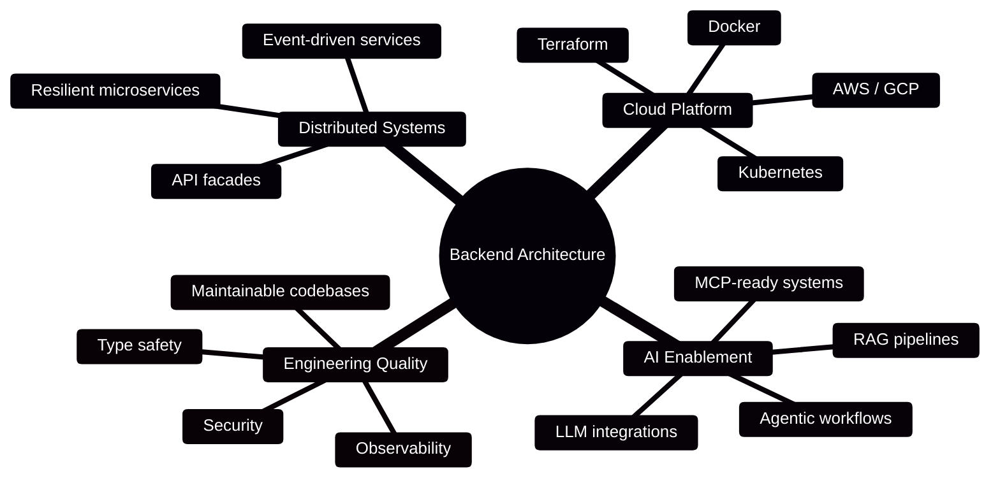
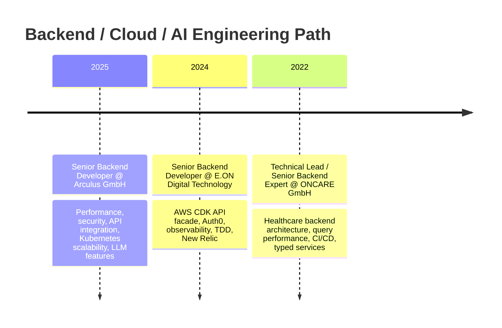

<!--
  GitHub Profile README for @meghrazchi
  Put this file in a public repository named exactly: meghrazchi/README.md
-->

<div align="center">

[](https://git.io/typing-svg)

<p>
  <a href="https://meghrazchi.com">
    
  </a>
  <a href="https://www.linkedin.com/in/behzad-meghrazchi/">
    
  </a>
  <a href="https://github.com/meghrazchi">
    
  </a>
</p>

</div>

---

## 🧭 `whoami`

```bash
$ curl -s https://meghrazchi.com/api/profile | jq
{
  "name": "Behzad Meghrazchi",
  "role": "Principal Backend Architect",
  "base": "Munich, DE",
  "status": "Open for innovation",
  "mission": "Building resilient digital backbones",
  "focus": [
    "high-performance microservices",
    "cloud-native infrastructure",
    "distributed systems",
    "LLM integration",
    "RAG pipelines",
    "agentic AI"
  ]
}
```

I design backend systems that stay **boring where reliability matters** and become **experimental where AI creates durable advantage**.

My work sits at the intersection of:



---

## 🛰️ System Telemetry

<div align="center">

| Signal | Value | Runtime Meaning |
|---|---:|---|
| 🟢 **TOTAL_UPTIME** | `99.98%` | reliability-first engineering |
| 🚀 **CODE_SHIPPED** | `142k+ LOC` | production-grade delivery |
| ⚡ **API_LATENCY** | `42ms` | optimized critical paths |
| 🌍 **PROJECTS_DEPLOYED** | `24` | systems built for real users |

</div>

---

## 🧠 Operating Principles

> Complexity is the enemy of reliability. I design systems that remain transparent, observable, and manageable at scale.

- 🧱 **Architecture before abstraction** — clear boundaries, explicit contracts, fewer surprises.
- 🔐 **Security as a platform concern** — OAuth2/OIDC, OPA, mTLS, policy enforcement.
- 📈 **Observability by default** — metrics, traces, logs, feedback loops, and fast MTTR.
- 🧪 **AI with guardrails** — RAG, citations, confidence signals, and human-verifiable outputs.
- 🛠️ **Boring tech for critical paths** — innovation is most useful when the system still sleeps at night.

---

## ⚙️ Tech Stack

### 🧩 Languages & Runtime

<p>
  
  
  
  
  
  
</p>

### ☁️ Cloud, Platform & DevOps

<p>
  
  
  
  
  
  
</p>

### 🗄️ Data, Search & Messaging

<p>
  
  
  
  
  
  
  
  
  
</p>

### 📊 Observability & Security

<p>
  
  
  
  
  
  
  
</p>

---

## 🤖 AI / LLM Engineering

```txt
llm_pipeline/
├── ingest        → PDFs, DOCX, TXT, business documents
├── chunk         → semantic splitting, metadata, ownership
├── embed         → vector search, hybrid retrieval, reranking
├── reason        → prompts, tools, agents, confidence signals
├── cite          → source-grounded answers
└── observe       → traces, usage metrics, evaluation loops
```

I’m especially interested in production AI systems that are:

- 🧾 **source-grounded**
- 🧠 **context-aware**
- 🧰 **tool-enabled**
- 🔍 **observable**
- 🧪 **evaluated**
- 🛡️ **safe enough for real workflows**

---

## 🚀 Featured Systems

| Project | What it does | Stack |
|---|---|---|
| 🧠 [**Rudix**](https://gitlab.com/benza-group/rudix) | AI Document Q&A assistant with RAG, citations, confidence signals, and usage metrics. | FastAPI · Next.js · Qdrant · Celery |
| 💸 [**BillPilot**](https://gitlab.com/benza-group/bill-pilot) | Workspace-first financial operations platform for accounts, budgets, receipts, recurring activity, and reporting. | Spring Boot · Kotlin · Angular · PostgreSQL · OpenAI |
| 🚲 [**Bike Case Tracker**](https://gitlab.com/benza-group/bike-case-tracker) | Bike-theft case browser with BFF architecture, JWT auth, Prisma/Postgres sessions, Redis cache, Docker runtime, and CI-ready tests. | Next.js · TypeScript · Prisma · Postgres · Redis |
| 📚 [**Word Ladder**](https://gitlab.com/benza-group/word-ladder) | Vocabulary learning platform with spaced review, semantic search, AI conversation practice, writing review, PWA support, and CI/CD. | React · NestJS · Prisma · pgvector · OpenAI |

---

## 🧬 GitHub Lab

<div align="center">

<div style="display: inline-block; padding: 18px; border: 1px solid #e5e7eb; border-radius: 16px; background: #ffffff; box-shadow: 0 10px 30px rgba(15, 23, 42, 0.08);">
  <a href="https://github.com/meghrazchi/website">
    
  </a>
  <a href="https://github.com/meghrazchi/go-boilerplate">
    
  </a>
  <a href="https://github.com/meghrazchi/rudix">
    
  </a>
</div>

</div>

---

## 📈 Stats Console

<div align="center">

<div style="display: inline-block; padding: 18px; border: 1px solid #e5e7eb; border-radius: 16px; background: #ffffff; box-shadow: 0 10px 30px rgba(15, 23, 42, 0.08);">
  
  

  

  <div align="center" style="margin-top: 12px; color: #333333;">
    <strong>GitHub trophies</strong>
    <br />
    <sub>Temporarily unavailable due to upstream rendering limits.</sub>
  </div>
</div>

</div>

---

## 🧑‍💻 Experience Snapshot



---

## 🛠️ Current Build Mode

```yaml
current_status:
  - refactoring_legacy_monoliths
  - cloud_native_optimization
  - event_driven_service_design
  - secure_api_platforms
  - llm_features_with_real_observability
```

---

## 🧾 Architecture Notes I Care About

| Theme | My bias |
|---|---|
| 🧩 Service design | Make boundaries boring, contracts explicit, and failure modes visible. |
| 🧱 Legacy modernization | Reduce risk first, then increase speed. |
| ☁️ Cloud infrastructure | Automate the path, document the edges, observe the runtime. |
| 🔐 Platform security | Centralized policy beats duplicated authorization logic. |
| 🤖 LLM features | A useful AI answer should be grounded, inspectable, and measurable. |

---

## 📡 Connect

<div align="center">

### Building something backend-heavy, cloud-native, or AI-enabled?

<div style="display: inline-block; padding: 16px 22px; border: 1px solid rgba(255, 255, 255, 0.12); border-radius: 12px; background: #111827; text-align: left;">
  <div style="margin-bottom: 12px; font-weight: 700; color: #EDE9FE;">POST /contact</div>
<pre style="margin: 0; text-align: left; color: #E5E7EB; background: transparent;">
{
  "topic": "resilient digital systems",
  "channels": ["portfolio", "linkedin", "github"],
  "response": "let's build the backbone"
}
</pre>
</div>

<br />

<p>
  <a href="https://meghrazchi.com">
    
  </a>
  <a href="https://www.linkedin.com/in/behzad-meghrazchi/">
    
  </a>
</p>

</div>

---

<div align="center">


`SYSTEM_STATUS: OPEN_FOR_INNOVATION`

</div>
